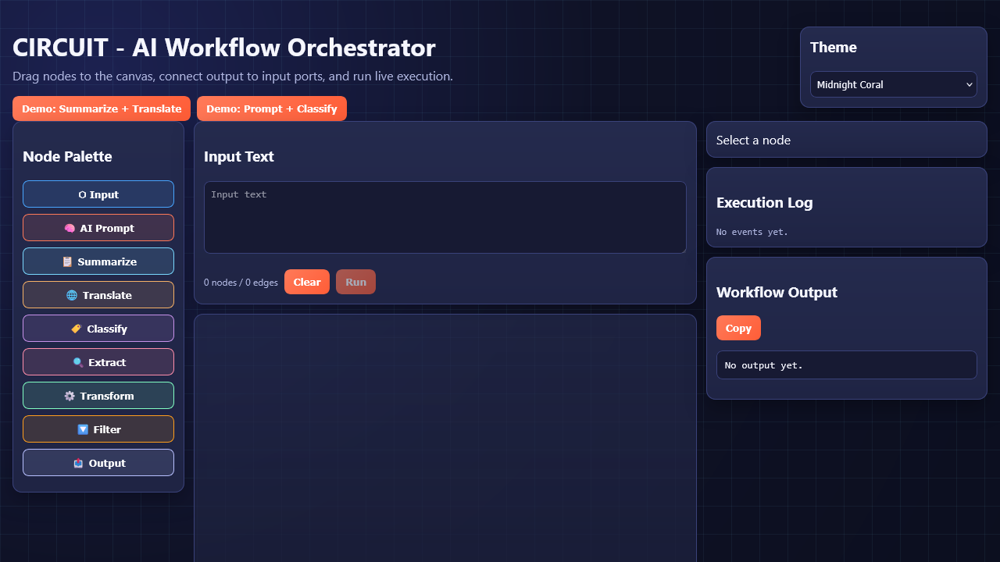
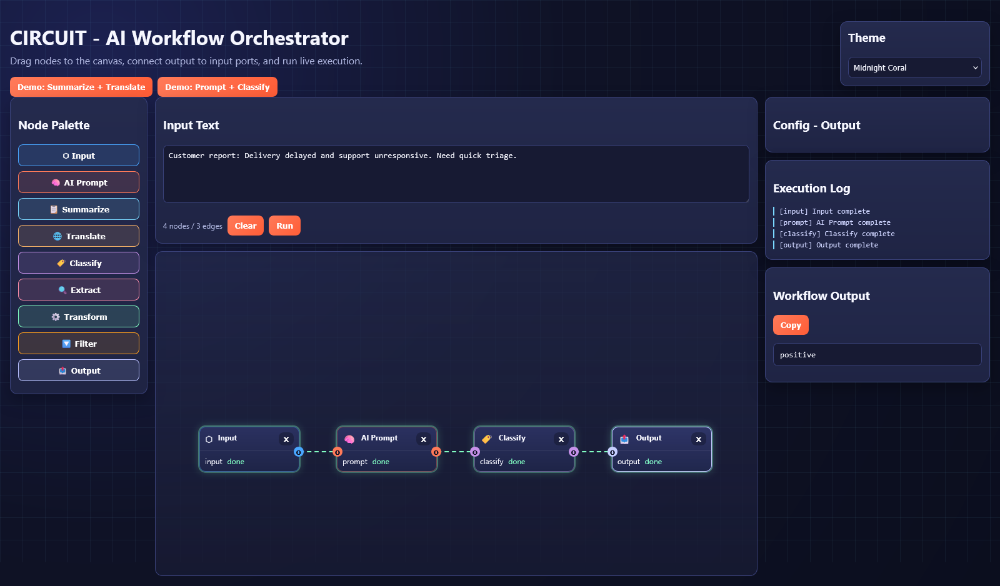

<div align="center">

# ⚡ CIRCUIT

### Visual AI Workflow Orchestrator — Drag, Connect, Execute

[](https://www.python.org/)
[](https://fastapi.tiangolo.com/)
[](https://react.dev/)
[](https://groq.com/)
[](LICENSE)

<br/>

> **CIRCUIT** is a production-style visual workflow platform for AI pipelines. Build a graph with nodes like prompt/summarize/translate/classify/extract, connect edges on a live canvas, and watch execution events stream in real time with animated node and wire states.

<br/>

   

</div>

---

## 📋 Table of Contents

- [Overview](#-overview)
- [Application Preview](#-application-preview)
- [Features](#-features)
- [Architecture](#-architecture)
- [Tech Stack](#-tech-stack)
- [Project Structure](#-project-structure)
- [Installation](#-installation)
- [Usage](#-usage)
- [API Reference](#-api-reference)
- [Configuration](#-configuration)
- [Testing](#-testing)
- [Security Notes](#-security-notes)
- [Design Decisions](#-design-decisions)
- [License](#-license)

---

## 🧠 Overview

CIRCUIT focuses on agentic workflow design with a visual-first UX.  
The backend executes node graphs in dependency order, merges upstream inputs, runs Groq-powered transformations, and emits live execution events over WebSocket. The frontend renders an interactive canvas with drag/drop node creation, edge wiring, execution highlighting, logs, and final output.

Users can:

- Build and edit workflows visually
- Run end-to-end pipelines with node-level progress
- Configure behavior per node type
- Stream live execution updates in UI
- Protect endpoints with API key auth and rate limits
- Deploy quickly with Docker Compose

---

## 🖼️ Application Preview

<div align="center">

### 1) Builder Canvas


<br/>

### 2) Execution + Output


<br/>

### 3) Demo GIF


</div>

---

## ✨ Features

| Feature | Description |
|---|---|
| 🧩 **Visual Node Editor** | Add nodes, connect ports, and construct multi-step AI pipelines on an interactive canvas |
| ⚡ **Live Execution Stream** | WebSocket events (`workflow_start`, `node_start`, `node_complete`, `workflow_complete`) update UI in real time |
| 🤖 **Groq-Powered Nodes** | Prompt, summarize, translate, classify, extract, transform, and filter via Groq backend |
| 🎯 **Execution State Visuals** | Active nodes and edges animate during run, with completion states and log feed |
| 🎨 **Theme System** | Three selectable themes with persisted user preference (`localStorage`) |
| 🔐 **Optional API Key Auth** | Set `APP_API_KEY` to protect critical API endpoints and WebSocket access |
| ⏱️ **Rate Limiting** | SlowAPI-powered per-IP limits for execution and latest-result endpoints |
| 📜 **Structured JSON Logging** | Request and execution events emitted in JSON for observability |
| 🧪 **Backend Tests** | FastAPI + workflow engine tests via pytest |
| 🐳 **Docker Deployment** | Backend + frontend containerized with compose orchestration |

---

## 🏗️ Architecture

```
┌─────────────────────────────────────────────────────────────────────┐
│                          React Frontend                             │
│                                                                     │
│  NodePalette ─┐                                                     │
│  CircuitCanvas├──► Workflow graph state (nodes/edges/configs)       │
│  NodeConfig   │                                                     │
│  ExecutionLog ┘                                                     │
│            │                                                        │
│            ├── REST: POST /execute, GET /latest, GET /node-types    │
│            └── WS: /ws (live execution events)                      │
└──────────────────────────────┬──────────────────────────────────────┘
                               │
                               ▼
┌─────────────────────────────────────────────────────────────────────┐
│                          FastAPI Backend                            │
│                                                                     │
│  main.py                                                            │
│   ├─ CORS + optional API-key auth + rate limiting                  │
│   ├─ /execute => workflow_engine.execute_workflow                   │
│   ├─ /latest, /node-types                                           │
│   └─ /ws broadcast loop                                              │
│                                                                     │
│  workflow_engine.py                                                  │
│   ├─ topological execution ordering                                  │
│   ├─ predecessor input merge                                         │
│   └─ node-level execution logs/events                                │
│                                                                     │
│  node_executors/*.py + groq_service.py                              │
└─────────────────────────────────────────────────────────────────────┘
```

---

## 🛠️ Tech Stack

| Layer | Technology |
|---|---|
| **Backend** | FastAPI, Pydantic v2, Uvicorn, Python 3.12 |
| **LLM Provider** | Groq Chat Completions API |
| **Frontend** | React 18, Framer Motion, custom CSS |
| **Realtime** | WebSocket |
| **Security** | API key middleware + SlowAPI rate limits |
| **Observability** | JSON structured logging (`python-json-logger`) |
| **Testing** | Pytest, pytest-asyncio |
| **Deployment** | Docker, Nginx, Docker Compose |

---

## 📁 Project Structure

```
circuit-orchestrator/
│
├── backend/
│   ├── main.py
│   ├── workflow_engine.py
│   ├── groq_service.py
│   ├── security.py
│   ├── logging_config.py
│   ├── node_executors/
│   │   ├── prompt_node.py
│   │   ├── summarize_node.py
│   │   ├── translate_node.py
│   │   ├── classify_node.py
│   │   ├── extract_node.py
│   │   ├── transform_node.py
│   │   └── filter_node.py
│   ├── tests/
│   │   ├── test_api.py
│   │   └── test_workflow_engine.py
│   ├── requirements.txt
│   ├── Dockerfile
│   └── .env.example
│
├── frontend/
│   ├── src/
│   │   ├── App.jsx
│   │   ├── pages/OrchestratorPage.jsx
│   │   ├── hooks/
│   │   │   ├── useWorkflow.js
│   │   │   └── useWebSocket.js
│   │   ├── components/ (canvas, nodes, wires, controls, logs, output)
│   │   └── styles/globals.css
│   ├── public/index.html
│   ├── Dockerfile
│   └── nginx.conf
│
├── docs/media/
│   └── README.md
│
├── docker-compose.yml
├── DECISIONS.md
├── LICENSE
└── README.md
```

---

## 🚀 Installation

### 1) Clone

```bash
git clone https://github.com/crastatelvin/circuit-orchestrator.git
cd circuit-orchestrator
```

### 2) Backend

```bash
cd backend
python -m venv venv
venv\Scripts\activate
pip install -r requirements.txt
copy .env.example .env
python -m uvicorn main:app --reload --port 8000
```

### 3) Frontend

In a second terminal:

```bash
cd frontend
npm install
npm start
```

Frontend: `http://localhost:3000`  
Backend docs: `http://localhost:8000/docs`

---

## 💻 Usage

1. Add nodes from left palette (click or drag-drop to canvas)
2. Connect node ports (output -> input)
3. Set input text and node configs
4. Click **Run**
5. Watch live execution and review final output

Quick smoke test:

```bash
curl -X GET http://localhost:8000/
```

---

## 📡 API Reference

| Method | Endpoint | Description |
|---|---|---|
| `GET` | `/` | Service status |
| `GET` | `/node-types` | Available node definitions |
| `POST` | `/execute` | Execute workflow graph JSON |
| `GET` | `/latest` | Get latest execution output |
| `WS` | `/ws` | Live execution event stream |

---

## ⚙️ Configuration

`backend/.env`:

```bash
GROQ_API_KEY=...
APP_API_KEY=
```

- `APP_API_KEY` is optional. If set, required for `/execute`, `/latest`, and `/ws`.

---

## 🧪 Testing

Backend:

```bash
cd backend
venv\Scripts\activate
python -m pytest -q
```

Frontend:

```bash
cd frontend
npm run build
```

---

## 🔒 Security Notes

- Optional API key auth via `APP_API_KEY`
- Request rate limiting enabled on critical endpoints
- CORS is currently permissive for development; tighten in production
- Keep real API keys only in `.env` (never commit secrets)

---

## 🧭 Design Decisions

See [`DECISIONS.md`](./DECISIONS.md) for architecture rationale, including:

- custom canvas-based workflow editor approach
- execution ordering strategy
- animation/UX tradeoffs for visual orchestration

---

## License

This project is licensed under the MIT License. See [LICENSE](./LICENSE).

Built by Telvin Crasta · Visual orchestration · Real-time execution
